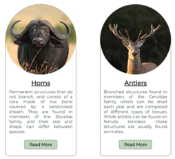
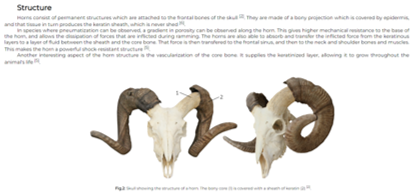
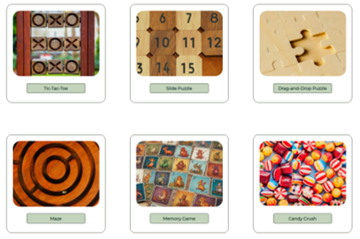

# AHOOOs

This is a simple website created for me to practice HTML, CSS, and JavaScript, with a primary focus on the anatomy and physiology of horns, antlers, and similar structures. Future updates will include a store and animal-related games, which I plan to develop using JavaScript.

## 1. Tools

- **HTML:** used for creating the structure of the webpages .
- **CSS:** used for designing and styling the webpages.
- **Javascript:** used for creating interactive games.

## 2. To-Do

- **1.** Add more information to the remaining pages
- **2.** Develop a few animal-related games using Javascript 
- **3.** Include a small store where people can buy merch related to the animals discussed on the website

## 3. Screenshots

Below are a few screenshots showing how a few parts of my website look.

 
*Cards on the main screen containing links to two different pages.*

 
*Example of the content found in one of the informative pages.*

 
*Page containing cards that link to different games, which are under development.*

## 4. References

I am still new to HTML/CSS and Javascript so I often take a look into some material to help me. 

Below are the main courses I took to learn these languages. Other resources may be included in the future.

- [HTML/CSS and Javascript (Portuguese)](https://www.youtube.com/c/CursoemV%C3%ADdeo)

- [Javascript (Portuguese)](https://www.udemy.com/course/aprenda-javascript-com-facilidade-do-zero)